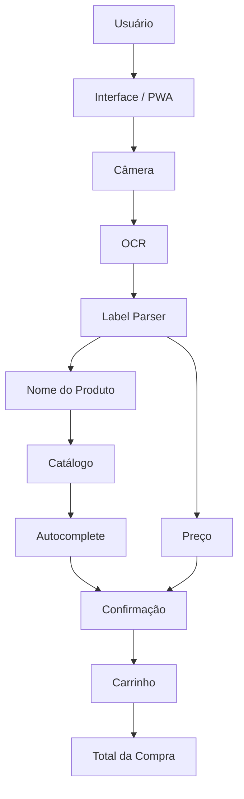
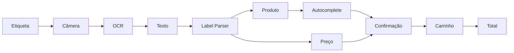
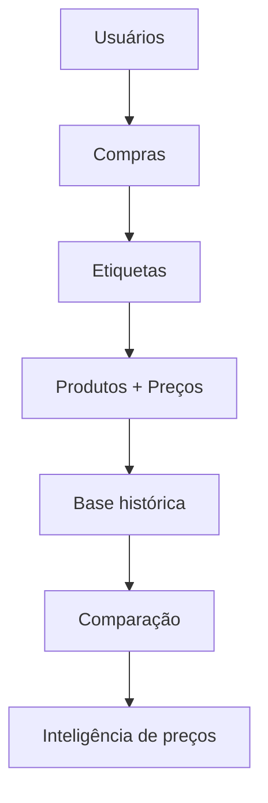

<div align="center">

# 🛒 Messo

### Seu assistente durante as compras no supermercado.

Use a câmera do celular para ler etiquetas, identificar produtos e preços, montar seu carrinho e acompanhar o valor da compra em tempo real.

<br>


</div>

---

## 📌 Sobre o projeto

O **Messo** é uma aplicação mobile-first criada para auxiliar consumidores durante compras presenciais em supermercados.

A ideia é reduzir tarefas manuais como procurar produtos, digitar preços e calcular constantemente quanto já foi gasto.

O fluxo principal é simples:

```text
Apontar a câmera
        ↓
Ler a etiqueta
        ↓
Identificar produto e preço
        ↓
Confirmar
        ↓
Adicionar ao carrinho
        ↓
Acompanhar o total
```

O Messo utiliza OCR como ferramenta de assistência, mantendo o usuário no controle da informação antes que ela seja adicionada à compra.

---

## ✨ Principais funcionalidades

- 📷 Captura de etiquetas utilizando a câmera
- 🔎 Extração de texto com OCR
- 🏷️ Interpretação das informações da etiqueta
- 🔤 Identificação assistida do nome do produto
- 🔍 Autocomplete utilizando catálogo de produtos
- 💰 Identificação de preços
- 🏷️ Tratamento de preço normal e promocional
- ⚖️ Tratamento de produtos vendidos por peso
- 🛒 Carrinho de compras
- 🧮 Cálculo automático do total
- 📱 Experiência mobile-first
- 🌐 Aplicação PWA

---

## 🎯 Problema

Durante uma compra no supermercado, o consumidor frequentemente precisa:

- conferir o preço dos produtos;
- acompanhar quanto já gastou;
- identificar promoções;
- diferenciar preço unitário e preço por peso;
- conferir produtos vendidos por quilograma;
- calcular manualmente o valor acumulado da compra.

O Messo busca transformar esse processo em uma experiência mais simples.

---

## 🚀 Como funciona

Imagine uma etiqueta como:

```text
ARROZ BRANCO TIPO 1 5KG

R$ 24,90
```

O fluxo realizado pelo Messo é:

```text
Etiqueta
   ↓
Câmera
   ↓
OCR
   ↓
Texto bruto
   ↓
Label Parser
   ↓
Produto + preço
   ↓
Autocomplete
   ↓
Confirmação
   ↓
Carrinho
```

O OCR não escolhe automaticamente o produto.

Ele funciona como uma forma de **preenchimento assistido**.

Por exemplo:

```text
OCR

"ARROZ BRANCO TIPO 1 5KG"

        ↓

Campo de produto

        ↓

Autocomplete

        ↓

Arroz Branco Tipo 1 5kg
Arroz Integral 5kg
Arroz Parboilizado 5kg

        ↓

Usuário confirma
```

Dessa forma, o Messo reduz a quantidade de digitação sem depender de uma leitura 100% perfeita.

---

# 🏗️ Arquitetura

O Messo utiliza uma arquitetura modular, separando captura, OCR, interpretação da etiqueta, catálogo e regras do carrinho.



---

## 🧩 Responsabilidades

### 📱 Interface / PWA

Responsável pela experiência do usuário.

Inclui:

- acesso à câmera;
- formulário de produto;
- autocomplete;
- confirmação;
- carrinho;
- visualização do total.

---

### 📷 Câmera

Responsável somente pela captura da imagem.

```text
Etiqueta
   ↓
Câmera
   ↓
Imagem
```

A câmera não possui responsabilidade sobre interpretação de produto ou preço.

---

### 🔎 OCR

Responsável por transformar uma imagem em texto.

Exemplo:

```text
ARROZ BRANCO TIPO 1 5KG

PREÇO KG 4,98

R$ 24,90
```

O OCR funciona como **fonte de dados**.

Ele não determina diretamente qual produto deve ser adicionado ao carrinho.

---

### 🧠 Label Parser

O `Label Parser` recebe o texto produzido pelo OCR e tenta identificar as informações relevantes da etiqueta.

Entre elas:

```text
Nome do produto
Quantidade
Unidade
Preço
Preço promocional
Preço por peso
Preço total
```

Essa camada existe porque etiquetas de supermercado podem possuir estruturas muito diferentes.

---

### 📦 Produto

O nome identificado pelo parser é utilizado como entrada para o campo de produto.

```text
OCR
 ↓
Label Parser
 ↓
Nome identificado
 ↓
Campo de produto
 ↓
Autocomplete
```

A escolha definitiva continua sendo realizada pelo usuário.

---

### 📚 Catálogo

O catálogo mantém os produtos conhecidos pelo sistema.

Ele é utilizado principalmente para permitir:

```text
Texto encontrado
      ↓
Busca
      ↓
Produtos compatíveis
      ↓
Autocomplete
```

---

### 🛒 Carrinho

Depois da confirmação, o produto é adicionado ao carrinho.

```text
Produto
+
Preço
+
Quantidade

    ↓

Subtotal

    ↓

Carrinho

    ↓

Total
```

---

# 🔄 Fluxo completo



---

# 🧠 Decisão arquitetural

Um dos princípios mais importantes do projeto é:

```text
OCR ≠ Produto

OCR ≠ Carrinho

OCR ≠ Regra de negócio
```

O OCR apenas fornece informações.

A interpretação pertence ao parser.

A busca pertence ao fluxo de produtos.

O catálogo fornece opções conhecidas.

O carrinho possui suas próprias regras.

E a decisão final continua com o usuário.

Essa separação permite que o mecanismo de OCR seja substituído ou melhorado futuramente sem exigir mudanças profundas no restante da aplicação.

---

# 🏷️ Desafios das etiquetas

Um dos principais desafios técnicos do Messo é que etiquetas de supermercado não possuem um formato único.

Uma etiqueta pode apresentar, por exemplo:

```text
BANANA PRATA

PREÇO KG
R$ 7,99

PESO
0,750 KG

TOTAL
R$ 5,99
```

Neste cenário existem dois preços diferentes:

```text
R$ 7,99 → preço por quilograma

R$ 5,99 → preço referente à pesagem
```

Outro exemplo:

```text
CAFÉ 500G

R$ 19,99

OFERTA

R$ 16,99
```

Nesse caso:

```text
R$ 19,99 → preço normal

R$ 16,99 → preço promocional
```

Por isso o projeto não depende apenas da extração de texto.

Existe uma camada adicional responsável por interpretar o conteúdo encontrado.

---

# 👤 Usuário no controle

Uma decisão importante do produto foi evitar tentar identificar automaticamente o produto quando existe incerteza.

Em vez disso:

```text
OCR
 ↓
Nome identificado
 ↓
Autocomplete
 ↓
Usuário confirma
```

O objetivo é utilizar automação para reduzir trabalho, e não eliminar o controle do usuário.

---

# 💡 Princípios do produto

### Simplicidade

Durante uma compra, cada interação adicional atrapalha a experiência.

O Messo busca reduzir a quantidade de ações necessárias.

### Mobile First

O principal ambiente de utilização é o smartphone dentro do supermercado.

### Tolerância a erros

OCR não é perfeito.

O fluxo precisa permitir correções rápidas quando uma leitura estiver incorreta.

### Usuário no controle

Automação auxilia o usuário, mas não deve tomar decisões irreversíveis por ele.

### Evolução incremental

Primeiro resolver bem o fluxo principal.

Depois expandir a plataforma.

---

# 🛠️ Tecnologias

O projeto utiliza uma arquitetura web voltada para dispositivos móveis.

Principais conceitos e tecnologias envolvidos:

| Área | Tecnologia / Conceito |
|---|---|
| Interface | Web / Mobile First |
| Aplicação | PWA |
| Linguagem | JavaScript / TypeScript |
| Captura | Web Camera APIs |
| Reconhecimento | OCR |
| Produto | Catálogo + Autocomplete |
| Arquitetura | Modular |
| Plataforma | Web |

> A stack desta seção deve acompanhar a implementação real do projeto conforme novas tecnologias forem incorporadas.

---

# 📱 PWA

O Messo é desenvolvido como uma **Progressive Web App**.

Isso permite combinar a distribuição simples de uma aplicação web com características comuns de aplicativos mobile.

Entre elas:

- instalação no dispositivo;
- acesso pela tela inicial;
- interface mobile;
- possibilidade de funcionamento offline;
- utilização de APIs do dispositivo;
- atualização simplificada.

---

# 📂 Estrutura conceitual

```text
src/
│
├── components/
│   ├── camera/
│   ├── products/
│   └── cart/
│
├── services/
│   ├── ocr/
│   └── products/
│
├── parsers/
│   └── label/
│
├── domain/
│   ├── products/
│   └── cart/
│
├── hooks/
│
├── utils/
│
└── types/
```

A separação busca evitar que OCR, regras de produto, interface e carrinho fiquem fortemente acoplados.

> A estrutura acima representa a organização conceitual da aplicação e deve acompanhar a estrutura real do repositório durante sua evolução.

---

# 🗺️ Roadmap

## ✅ Fase 1 — MVP

Objetivo:

> Validar o uso do Messo durante uma compra real.

Principais funcionalidades:

- [x] Conceito do produto
- [x] Fluxo de carrinho
- [x] Catálogo de produtos
- [x] Autocomplete
- [x] Captura por câmera
- [x] OCR
- [x] Label Parser
- [x] Interpretação de nome
- [x] Interpretação de preço
- [ ] Refinamento da leitura em ambientes reais
- [ ] Testes em diferentes etiquetas
- [ ] Validação durante compras reais

---

## 🔄 Fase 2 — Confiabilidade

- [ ] Melhorar interpretação das etiquetas
- [ ] Suportar mais padrões de supermercado
- [ ] Melhorar reconhecimento de promoções
- [ ] Melhorar produtos vendidos por peso
- [ ] Expandir catálogo
- [ ] Melhorar experiência de correção
- [ ] Realizar testes em diferentes mercados

---

## 🔮 Fase 3 — Plataforma

- [ ] Histórico de compras
- [ ] Lista de compras
- [ ] Histórico de preços
- [ ] Comparação de preços
- [ ] Preços compartilhados pela comunidade
- [ ] Comparação entre supermercados
- [ ] Alertas de preço
- [ ] Integrações com mercados
- [ ] Recomendações

---

# 🌎 Visão de longo prazo

O Messo começa como:

```text
Assistente de compras
```

Porém, cada compra pode gerar informações úteis sobre produtos e preços.



Isso abre espaço para uma evolução futura:

```text
Assistente de compras
        ↓
Histórico
        ↓
Comparação
        ↓
Preços compartilhados
        ↓
Mercados
        ↓
Inteligência de preços
```

---

# 👨‍💻 Engenharia

Além da proposta de produto, o Messo também é utilizado para explorar problemas reais de engenharia de software.

Entre eles:

- OCR;
- processamento de dados não estruturados;
- interpretação de texto;
- heurísticas;
- normalização de produtos;
- tratamento de incerteza;
- arquitetura desacoplada;
- experiência mobile;
- regras de negócio;
- evolução incremental;
- design de produto.

O desafio não é apenas:

> "ler texto de uma imagem".

É transformar informações imperfeitas do mundo real em uma experiência simples e confiável para o usuário.

---

# ▶️ Executando localmente

Clone o projeto:

```bash
git clone <URL_DO_REPOSITORIO>
```

Entre na pasta:

```bash
cd messo
```

Instale as dependências:

```bash
npm install
```

Execute o ambiente de desenvolvimento:

```bash
npm run dev
```

---

# 📜 Scripts

Consulte o `package.json` para verificar todos os scripts disponíveis.

Exemplos:

```bash
npm run dev
npm run build
npm run preview
```

---

# 🚧 Status

> **Messo está atualmente em desenvolvimento.**

O foco atual está na validação e melhoria do fluxo:

```text
📷 Capturar
    ↓
🔎 Ler
    ↓
🧠 Interpretar
    ↓
✅ Confirmar
    ↓
🛒 Adicionar
```

Antes de expandir o produto, a prioridade é tornar esse processo confiável e simples durante uma compra real.

---

# 🤝 Contribuição

O projeto está em desenvolvimento ativo.

As mudanças devem priorizar:

1. simplicidade;
2. experiência mobile;
3. confiabilidade;
4. baixo número de interações;
5. facilidade de correção;
6. responsabilidades bem separadas;
7. evolução incremental.

---

# 📄 Licença

A licença do projeto ainda será definida.

---

<div align="center">

### Messo

**Menos preocupação com a conta. Mais controle sobre a compra.**

</div>